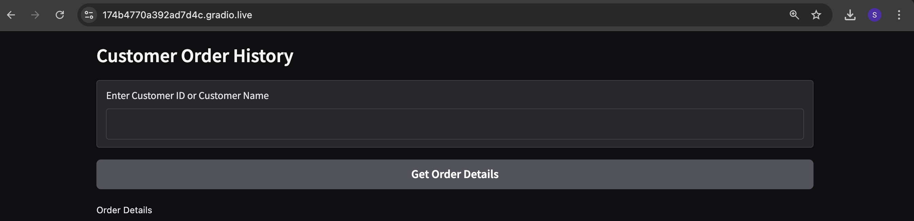

# Interactive PySpark Gradio App for Data Exploration.

Interactive Gradio App for Data Exploration.

PySpark + Gradio App that demonstrates transforming and exploring dataset of customers, orders and products. This repository contains two Jupyter notebooks: 
Data Transformation using PySpark and Gradio App

Contents
--------
- code/
  - `PySpark_Transform.ipynb` — data ingestion and transformation using PySpark. Reads `content/Customer.xlsx`, `content/Orders.json` and `content/Products.csv`, normalizes and joins them, and writes out analysis-ready tables.
  - `PySpark_Gradio_APP.ipynb` — a notebook that builds a lightweight Gradio UI to explore the transformed data (filters, summaries, simple visualizations).
- data/
  - `Customer.xlsx`, `Orders.json`, `Products.csv` — Datasets provided by PEI.

Quick start
-----------
Prerequisites

- Python 3.8+ (3.10 recommended)

1. Create a virtual environment (recommended):

	python -m venv .venv
	source .venv/bin/activate

2. Install dependencies:

	pip install -r requirements.txt

3. Please view the application at your localhost

Contact / Contribution
----------------------
More details available on verseAI.io and https://SQLverse.AI
